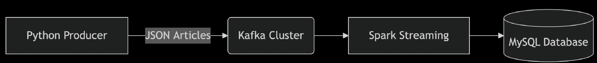

# ETL Pipeline: Real-time News Article Processing

This project implements an **ETL (Extract, Transform, Load)** pipeline for processing real-time cryptocurrency-related news articles.This system demonstrates streaming data processing using **Kafka**, **Spark Structured Streaming**, and **MySQL**.

---

## 📌 Overview

The pipeline:

- **Extracts** JSON-formatted news articles via an API
- **Transforms** data using Spark (schema enforcement, timestamp conversion, etc.)
- **Loads** clean records into a MySQL database for querying

---

## 🔧 Technologies Used

- **Kafka** – Distributed messaging system for real-time data
- **Spark Structured Streaming** – Data transformation and stream processing
- **Python** – API interaction and Kafka producer
- **MySQL** – Final data storage for analytics
- **Scala** – Used for Spark transformations

---

## 🧩 Pipeline Architecture



| Component              | Role                                                                 |
|------------------------|----------------------------------------------------------------------|
| `source_data.py`       | Extracts articles from NewsAPI and saves to `articles.json`          |
| `producer.py`          | Monitors `articles.json`, transforms data, and streams to Kafka      |
| `Kafka (finaltopic)`   | Message queue for real-time article delivery                         |
| `Spark (Scala)`        | Transforms messages and writes structured data to MySQL              |
| `MySQL`                | Stores cleaned and structured news articles                          |

---

## 🚀 Pipeline Stages

### 1. Data Extraction (Python)
- **Script**: `source_data.py`
- Connects to NewsAPI and fetches news articles with the keywords:
  `bitcoin`, `cryptocurrency`, `crypto`, `BTC`, `btc`
- Saves raw data to a local file: `articles.json`

 

---

### 2. Kafka Producer
- **Script**: `producer.py`
- Monitors the `articles.json` file for changes
- Performs the following:
  - Removes `urlToImage`
  - Converts `publishedAt` to datetime
  - Converts the `source` field into a key-value format
- Streams the cleaned JSON to the Kafka topic `finaltopic`

 

---

### 3. Data Transformation (Spark Structured Streaming)
- **Language**: Scala
- Spark reads from the Kafka topic, applies schema and transformations:
  - Enforces types like `StringType` and `TimestampType`
  - Handles nullable fields like `author` and `description`

 

---

### 4. Data Loading (MySQL)
- **Sink**: MySQL database
- Final structured records are written to `final.articles` table
- Example SQL Query to validate:

```sql
SELECT * FROM articles LIMIT 5;
```

 


---

## 📁 Folder Structure

```
/project-folder
│
├── images/
│   ├── 1.png
│   ├── 2.png
│   ├── 3.png
│   ├── 4.png
│   └── 5.png
│
├── json_consumer_hdfs.py
├── json_consumer.py
├── producer.py
├── source_data.py
├── sparkscala
└── README.md
```
 
---
